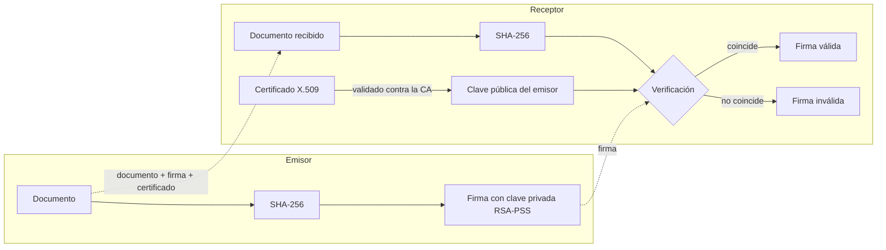

# 🔏 Demo de Firma Digital
 
Aplicación web educativa que demuestra cómo funciona la **firma digital de documentos** combinando **SHA-256**, **RSA-PSS** y una **Infraestructura de Clave Pública (PKI)** con certificados X.509. Permite firmar un documento, verificarlo, alterarlo para ver cómo la firma falla y simular un ataque con un certificado falso.
 
> Proyecto académico — *Introducción a la criptografía* · [Asignatura] · ESPOCH
> Integrantes: [Nombres del grupo]
 
## ¿Qué demuestra?
 
| Propiedad | Cómo se demuestra |
|---|---|
| **Integridad** | Al cambiar una sola letra del documento, la firma pasa de válida a inválida |
| **Autenticidad** | Solo la clave privada del emisor puede producir una firma que la clave pública verifique |
| **No repudio** | El emisor no puede negar una firma hecha con su clave privada |
| **Confianza (PKI)** | Un certificado falso con el mismo nombre es rechazado porque no está firmado por la CA de confianza |
 
## Funcionalidades
 
- **Hash SHA-256** de textos y archivos, con medición del efecto avalancha (bits que cambian entre dos hashes)
- **Generación de claves RSA** (2048 o 3072 bits) con exportación en PEM y clave privada protegida con contraseña
- **Firma digital** de texto o archivos con RSA-PSS + SHA-256
- **Verificación** dentro de la sesión o con archivos externos (documento, `.sig` y `.pem`)
- **Mini-PKI**: creación de una CA propia, emisión de certificados X.509 y validación de la cadena de confianza
- **Simulación de ataque**: certificado falso emitido por una CA impostora
- **Versión por consola** (`demo_consola.py`) y **pruebas automáticas** con pytest
## Cómo funciona
 

 
## Instalación
 
Requisitos: **Python 3.10 o superior**.
 
**Windows (PowerShell)**
```powershell
git clone https://github.com/<tu-usuario>/firma-digital-demo.git
cd firma-digital-demo
python -m venv .venv
.venv\Scripts\Activate.ps1
pip install -r requirements.txt
```
Si PowerShell bloquea la activación: `Set-ExecutionPolicy -Scope Process -ExecutionPolicy Bypass`
 
**Linux / macOS**
```bash
git clone https://github.com/<tu-usuario>/firma-digital-demo.git
cd firma-digital-demo
python3 -m venv .venv
source .venv/bin/activate
pip install -r requirements.txt
```
 
## Uso
 
```bash
streamlit run app.py        # interfaz web en http://localhost:8501
python demo_consola.py      # versión por consola (genera archivos en salida/)
pytest -v                   # pruebas automáticas
```
 
<!-- Agrega tus capturas en docs/img/ y descomenta:
## Capturas


-->
 
## Estructura del proyecto
 
```
firma-digital-demo/
├── app.py                 # Punto de entrada de la web (Streamlit): sidebar, progreso y 5 pestañas
├── demo_consola.py        # Demo por consola
├── requirements.txt
├── ui/                    # Interfaz, separada de la criptografía
│   ├── estado.py          # session_state, progreso del flujo guiado y datos de ejemplo
│   ├── componentes.py     # Piezas reutilizables: explicaciones, barra de pasos, diagrama
│   ├── bienvenida.py      # Pantalla de inicio
│   ├── barra_lateral.py   # Resumen de estado, accesos rápidos y reinicio
│   └── vista_*.py         # Una vista por pestaña (hash, claves, firmar, verificar, pki)
├── crypto_core/           # Lógica criptográfica, independiente de la interfaz
│   ├── hashing.py         # SHA-256 y efecto avalancha
│   ├── keys.py            # Generación, exportación y carga de claves RSA
│   ├── signing.py         # Firma y verificación (RSA-PSS + SHA-256)
│   └── pki.py             # CA propia y certificados X.509
├── tests/test_crypto.py   # Pruebas automáticas
├── documentos/            # Documentos de ejemplo
└── salida/                # Archivos generados por la demo de consola
```
 
## Tecnologías
 
Python · [`cryptography`](https://cryptography.io) · [Streamlit](https://streamlit.io) · pytest
 
## Notas de seguridad
 
- La seguridad no depende de ocultar el código (**principio de Kerckhoffs**): RSA, SHA-256 y X.509 son estándares públicos. La fortaleza está en la clave privada y en la matemática.
- Se usa una librería criptográfica estándar y auditada; **nunca** se implementa criptografía propia.
- Este proyecto es **educativo**. La app permite descargar la clave privada solo por fines de demostración; en un sistema real la clave privada no sale del dispositivo o de un módulo seguro (HSM).
- Los certificados de la mini-PKI son de prueba y no sustituyen a una autoridad certificadora real.
## Licencia
 
MIT — ver el archivo `LICENSE`.
 
